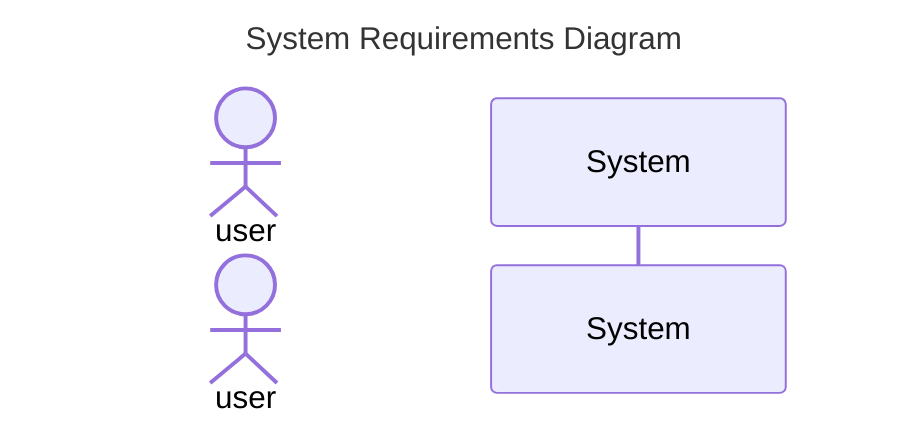

The documentation for sequence diagrams is located at [mermaid-js](https://mermaid-js.github.io/mermaid/#/sequenceDiagram)

Who does things in our requirements?
  1. The User - A human
     ```
     actor ...
     ```
  1. Our System - A computer
     ```
     participant ...
     ```
  1. The External System - A computer
  1. The Curator A human


