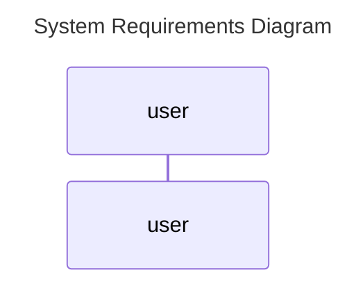

The documentation for sequence diagrams is located at [mermaid-js](https://mermaid-js.github.io/mermaid/#/sequenceDiagram)

Who does things in our requirements?
  * The User - A human
  * Our System - A computer
  * The External System - A computer
  * The Curator A human

