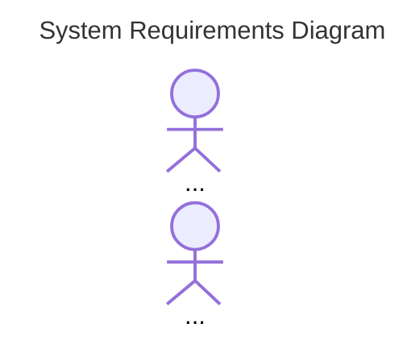

The documentation for sequence diagrams is located at [mermaid-js](https://mermaid-js.github.io/mermaid/#/sequenceDiagram)

Who does things in our requirements?
1. add an actor for the User
   ```
   actor ... as ...
   ```
1. add a participant for Our System
   ```
   participant ... as ...
   ```
1. add a participant for the External System
1. add an actor for the curator


