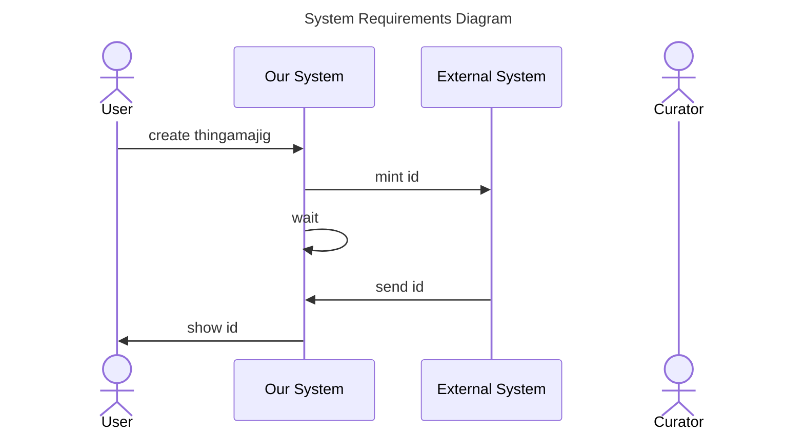

The documentation for sequence diagram messages is located at [mermaid-js/messages](https://mermaid.js.org/syntax/sequenceDiagram.html#messages)

How can we differentiate our actions?

1. change `create thingamajig` to a curved arrow
   ```
   user -) sys: ...
   ```
1. change `mint id` to a dashed line
   ```
   sys -->> ext: ...
   ```
1. change the wait to no arrow and a dashed line
   ```
   sys --> sys: ...
   ```
1. change `send id` to a dashed line
1. change `show id` to a curved arrow



