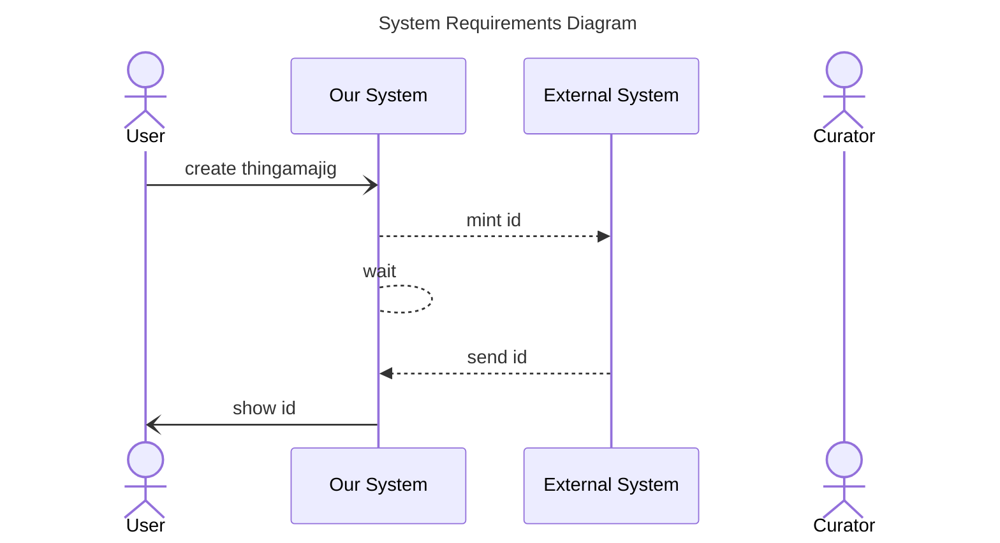

The documentation for sequence diagram messages is located at [mermaid-js/messages](https://mermaid.js.org/syntax/sequenceDiagram.html#messages)

How actors interact? Take the first requirement `A User created a new object: I need to mint a ID with ID System X`

1. change `create thingamajig` to a curved arrow
1. change `mint id` to a dashed line
1. change the wait to no arrow and a dashed line
1. change `send id` to a dashed line
1. change `show id` to a curved arrow

