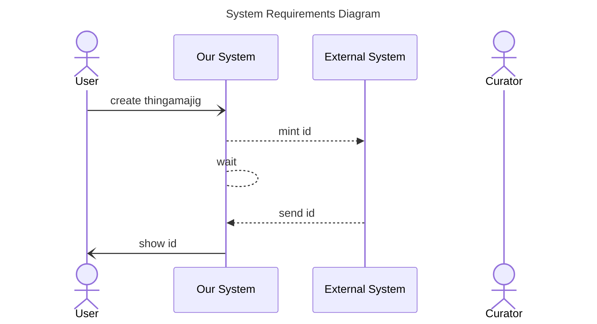

The documentation for sequence diagram notes is located at [mermaid-js/notes](https://mermaid.js.org/syntax/sequenceDiagram.html#notes)

1. Noting our wait time is typically 5 seconds
   ```
   note over sys,ext: ...
   ```
1. Noting our curator will "be approving things later"



