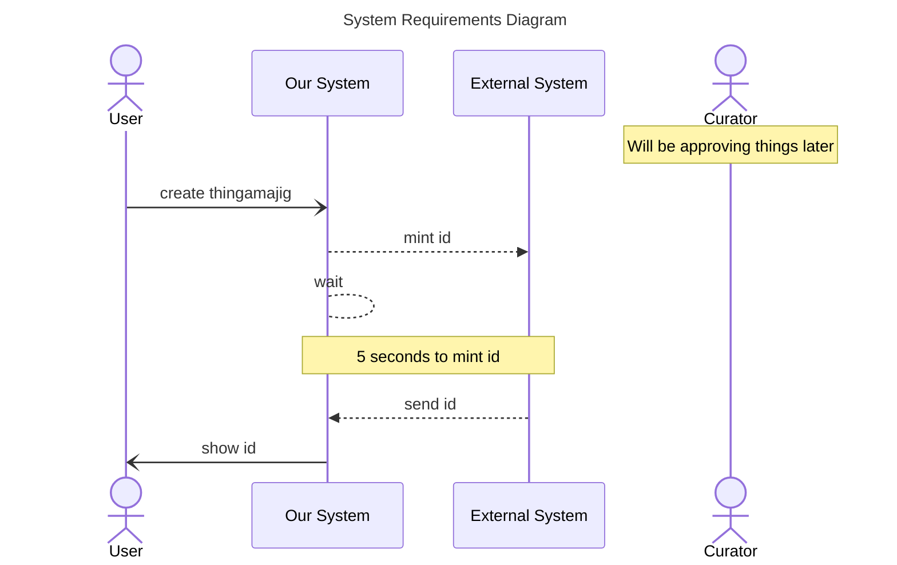

The documentation for sequence diagram notes is located at [mermaid-js/notes](https://mermaid.js.org/syntax/sequenceDiagram.html#notes)

Noting our wait time is typically 5 seconds
Noting our curator will be doing things later

