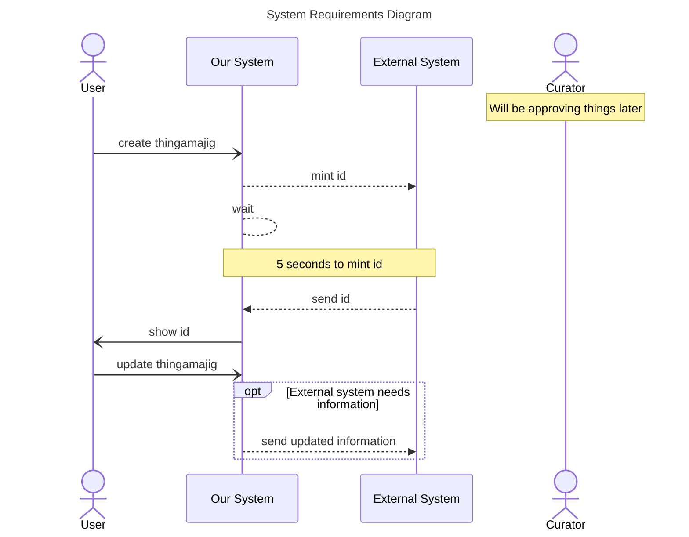

The documentation for sequence diagram notes is located at [mermaid-js/notes](https://mermaid.js.org/syntax/sequenceDiagram.html#notes)

A User updates the Thingamajig: Update the External System if the change is something they are interested

1. Add the User Updating the Metadata in Our System
1. Add a opt to show Our System Updating the External 

