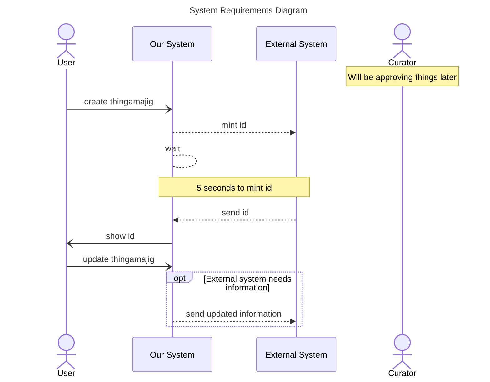

The documentation for background highlighting is located at [mermaid-js/background-highlighting](https://mermaid.js.org/syntax/sequenceDiagram.html#background-highlighting)

Style the diagram for visibility of the two flows

1. Add background highlighting to the “Create Workflow”
   ```
   rect ...
     ...
   end
   ```
1. Add background highlighting to the “Update Workflow”



