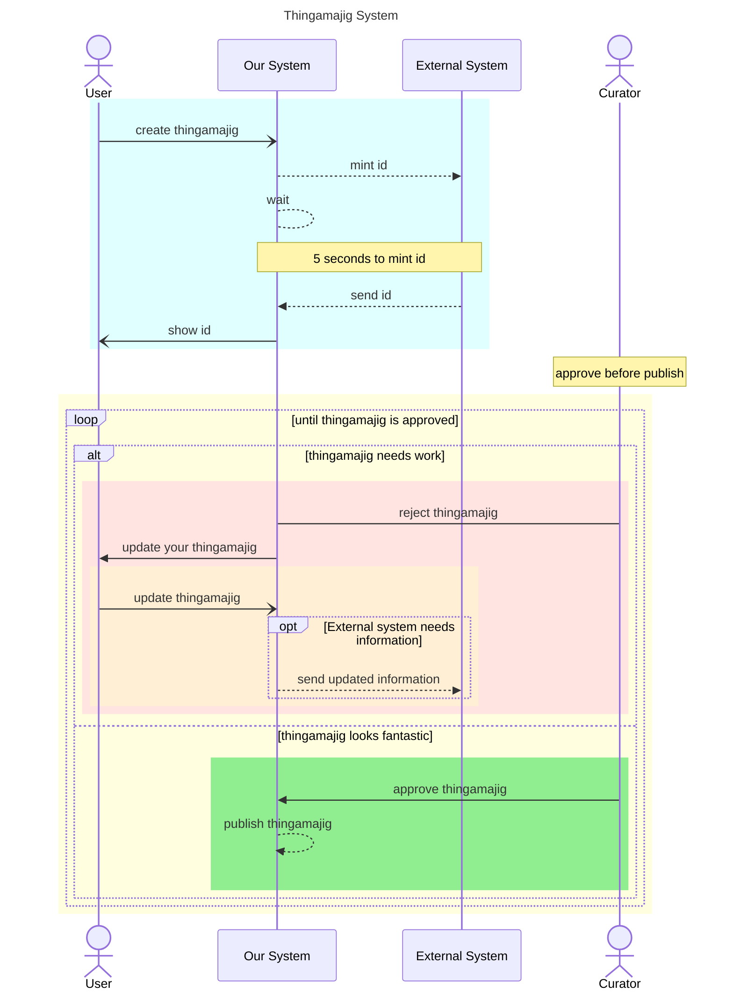

The documentation for looping is located at [mermaid-js/loop](https://mermaid.js.org/syntax/sequenceDiagram.html#loops)

add requirement 3 to our diagram “A Curator needs to approve the thingamajig for it to show up publicly in the system”

1. Add an alt for the Curator approving or rejecting a thingamajig
   ```
   alt ...
     curator -> sys: ...
   else ...
     curator -> sys: ...
   end
   ```
1. Add loop to show the above process happening multiple times
   ```
   loop ...
     ...
   end
   ```
1. Bonus: Style the new workflow



