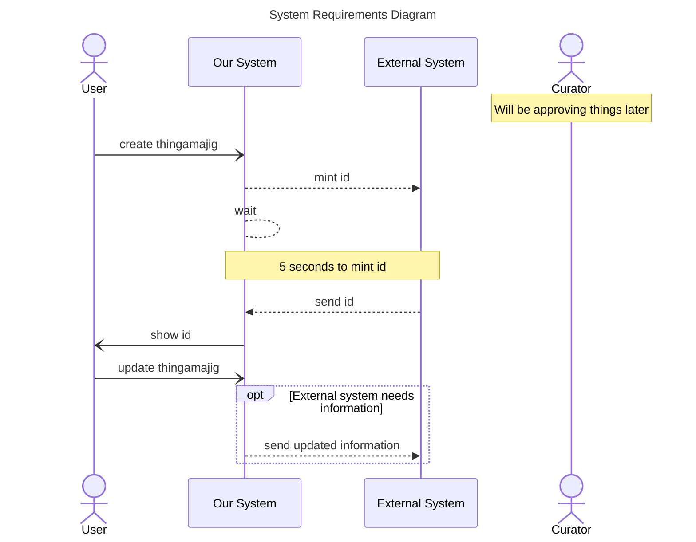

The documentation for Themes is located at [mermaid-js/themes](https://mermaid.js.org/config/theming.html#sequence-diagram-variables)

Add an overall theme

1. Add an overall theme “forest” or “neutral”
   ```
   %%{init: { 'theme': '...'} }%%

   ```
1. Add theme variables to change the “actorBorder” and “actorBkg” to a colors of your choosing
   ```
   %%{init: { 'theme': '...',
            'themeVariables': {
              'actorBkg': '...'
            }
         } 
   }%%
   ```



