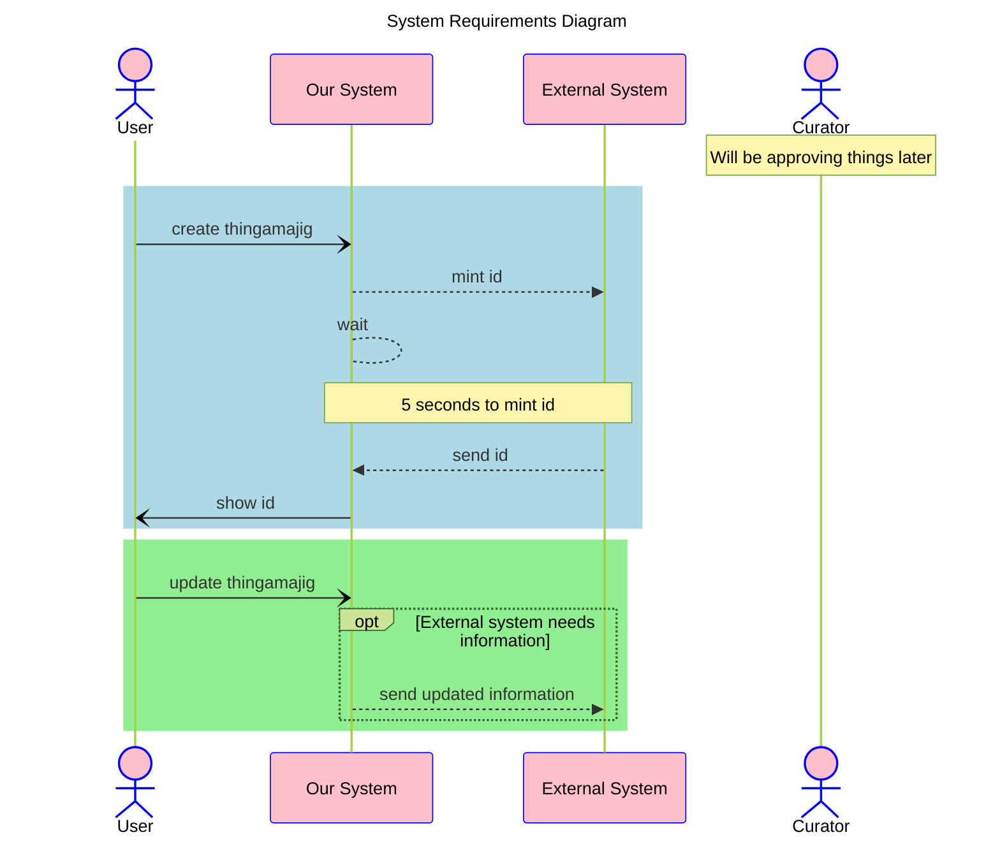

The documentation for Themes is located at [mermaid-js/themes](https://mermaid.js.org/config/theming.html#sequence-diagram-variables)

Style the diagram for visibility of the two flows

1. Add an overall theme “forest” or “neutral”
1. Add theme variables to change the “actorBorder” and “actorBkg” to a colors of your choosing

